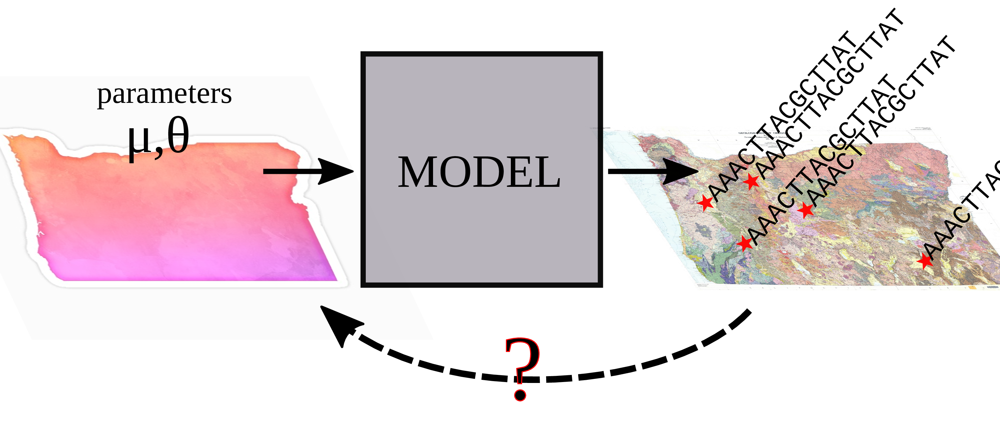
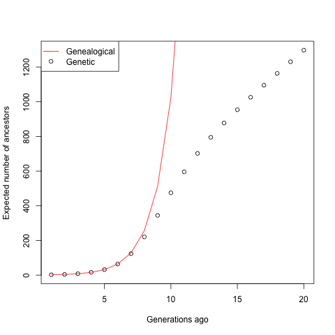
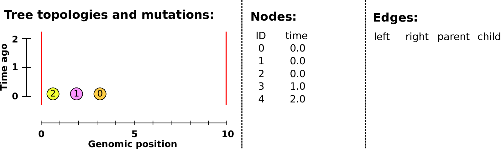
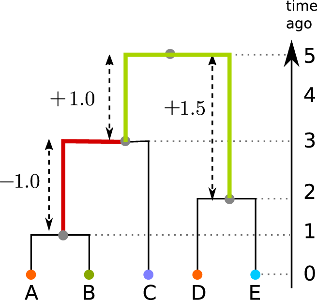
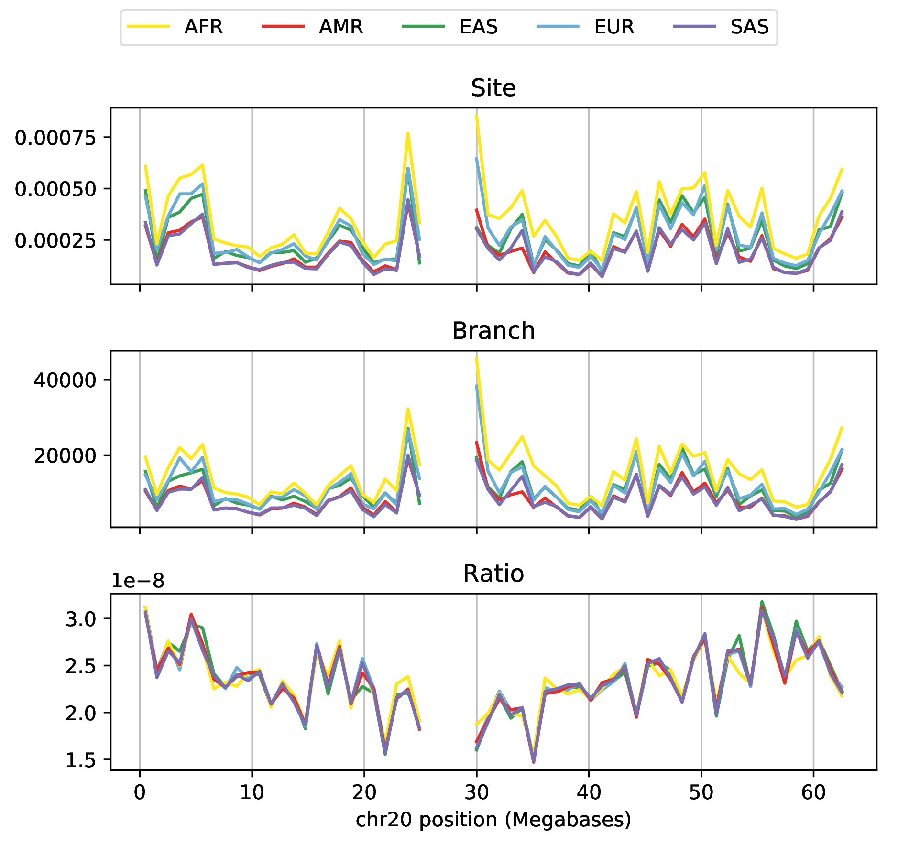
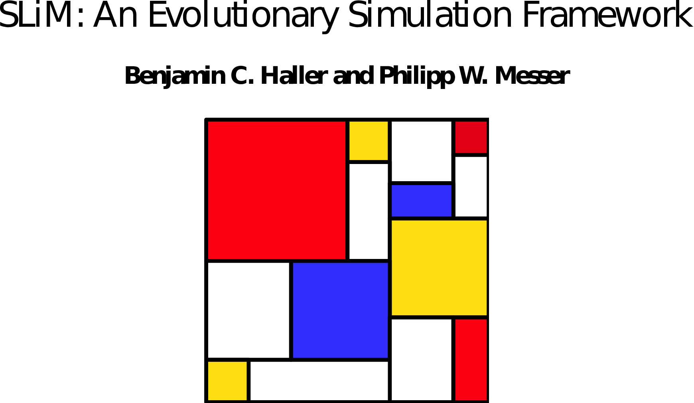
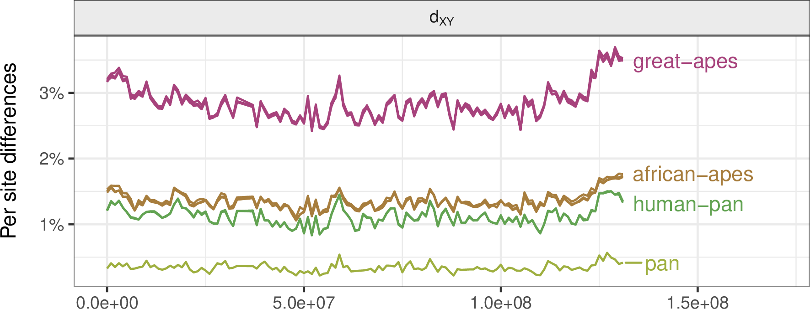
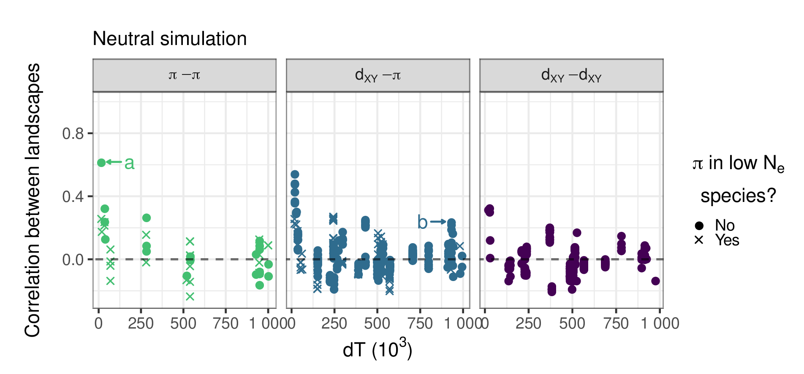
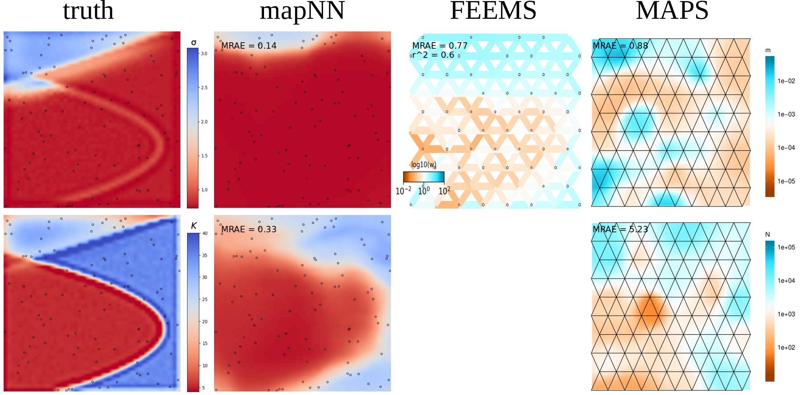
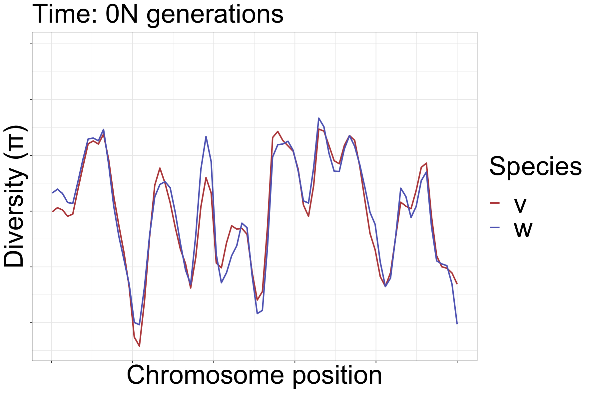

--------------------

> Both the UO and OSU are located on the traditional indigenous homeland of the Kalapuya people.
Kalapuya people were dispossessed of their indigenous homeland by the United States government and forcibly removed.
Today, Kalapuya descendants are primarily citizens of the Confederated Tribes of Grand Ronde and the Confederated Tribes of Siletz Indians,
and continue to make important contributions to their communities, to the UO, to Oregon, and to the world.

# Outline

## Outline of the talk

1. Genomes, and simulations
2. The tree sequence
3. Applications

*slides:* [github.com/petrelharp/corvallis-feb-2024](https://petrelharp.github.io/corvallis-feb-2024/corvallis-feb-2024.slides.html)

## Motivating problems

:::: {.columns}
:::::::: {.column width=60%}

1. How much natural selection is needed to explain the correlations in genetic diversity
    along the genomes of the great apes?

2. How can we predict the landscape of population density
    using spatial genomic data?

:::: 
:::::::: {.column width=40%}

{width=100%}

:::: 
::::::::

::: {.centered}
{width=60%}
::: 

# Inference, with genomes

##

##

##

##

##

## Simulation-based inference

::: {.centered}
{width=60%}
:::

- bespoke confirmatory simulations
- optimization of one or two parameters
    <!-- *(if between-simulation noise is small)* -->
- Approximate Bayesian Computation (ABC)
- deep learning

# What do we need

##

1. Fast simulation of genomes

2. Fast computation of summary statistics

## Wish list:

::: {.smallish}

::: {.columns}
::::::: {.column}

Whole genomes,
thousands of samples, \
from millions of individuals.

**Demography:**

- life history 
- separate sexes
- selfing
- polyploidy
- species interactions

**Geography:**

- discrete populations
- continuous landscapes
- barriers

**History:**

- ancient samples
- range shifts

:::
::::::: {.column}

**Natural selection:**

- selective sweeps
- introgressing alleles
- background selection
- quantitative traits
- incompatibilities
- local adaptation

**Genomes:**

- recombination rate variation
- gene conversion
- infinite-sites mutation
- nucleotide models
- context-dependence
- mobile elements
- inversions
- copy number variation

:::
:::::::

:::

## Enter SLiM

::: {.columns}
::::::: {.column width=50%}

by Ben Haller and Philipp Messer

an individual-based, scriptable forwards simulator

:::: {.caption}

*Ben Haller*
::::

:::
::::::: {.column width=50%}

[messerlab.org/SLiM](https://messerlab.org/SLiM/)

:::
:::::::

##

::: {.smallish}

::: {.columns}
::::::: {.column}

- <s>Whole genomes,</s>*
- <s>thousands of samples, </s>
- <s>from millions of individuals.</s>*

**Demography:**

- <s>life history</s>
- <s>separate sexes</s>*
- <s>selfing</s>
- polyploidy*
- <s>species interactions</s>

**Geography:**

- <s>discrete populations</s>
- <s>continuous landscapes</s>
- <s>barriers</s>*

**History:**

- <s>ancient samples</s>
- <s>range shifts</s>

:::
::::::: {.column}

**Natural selection:**

- <s>selective sweeps</s>
- <s>introgressing alleles</s>
- <s>background selection</s>
- <s>quantitative traits</s>*
- <s>incompatibilities</s>*
- <s>local adaptation</s>*

**Genomes:**

- <s>recombination rate variation</s>
- <s>gene conversion</s>
- <s>infinite-sites mutation</s>
- <s>nucleotide models</s>
- <s>context-dependence</s>*
- mobile elements*
- inversions*
- copy number variation

:::
:::::::

:::

## 

- <s>Whole genomes,</s>*

# Genomes and genealogies

## Genomes

> - are very big ($10^7$--$10^{12}$ nucleotides)
> - encode the basic *mechanisms* of life
> - reflect past *history* and *process*

. . .

## 

Your two copies of the genome
were inherited, noisily, from your two parents,

. . .

and from your four grandparents,

. . .

and your eight great-grandparents

. . .

and your sixteen great-great-grandparents

<!--

## Genealogical ancestors

In a well-mixed population of size $N$,

- A most recent common ancestor of *everyone* lived at $\approx \log_2 N$ generations ago.

- For humans: $\approx 500$ years; 
    but including geography and history,
    $\approx$ 2--3 thousand years
    (Chang ’99; Rohde, Olson & Chang ’04)

- *Everyone* alive $\approx 1.77 \log_2 N$ generations ago
    is either an ancestor of everyone or has left behind no descendants. (Chang ’99)

-->

## Meiosis & Recombination

::: {.columns}
::::::: {.column width=50%}

:::
::::::: {.column width=50%}

- You have two copies of each chromosome, 
  one from each parent.

- When you make a gamete, the copies *recombine*, at Poisson($\rho$) locations.

- *Mutations* appear at Poisson($\mu$) locations.

:::
::::::

<!--
## You and your great${}^{k-2}$-grand parents

The number of $k^\text{th}$ *genetic* ancestors
grows *linearly* with $k$.

::: {.centered}

:::

::: {.caption}
from [gcbias.org](https://gcbias.org/2013/11/11/how-does-your-number-of-genetic-ancestors-grow-back-over-time/)
:::

## 

::: {.centered}
{width=60%}
:::

::: {.caption}
from [gcbias.org](https://gcbias.org/2013/11/11/how-does-your-number-of-genetic-ancestors-grow-back-over-time/)
:::

## 

::: {.centered}
{width=60%}
:::

::: {.caption}
from [gcbias.org](https://gcbias.org/2013/11/11/how-does-your-number-of-genetic-ancestors-grow-back-over-time/)
:::

-->

<!-- Tree sequences -->

# The tree sequence

## History is a sequence of trees

For a set of sampled chromosomes,
at each position along the genome there is a genealogical tree
that says how they are related.

. . .

----------------------

The **succinct tree sequence**

::: {.floatright}
is a way to succinctly describe this, er, sequence of trees

*and* the resulting genome sequences.

:::: {.caption}
[Kelleher, Etheridge, & McVean](http://journals.plos.org/ploscompbiol/article?id=10.1371/journal.pcbi.1004842) 
::::
:::

. . .

::: {.columns}
:::::: {.column width=50%}

{width=80%}

:::
:::::: {.column width=50%}

::: {.floatright}
{width=50%}

:::: {.caption}
jerome kelleher
::::

:::

:::
::::::

## Example: three samples; two trees; two variant sites

## Nodes and edges

Edges 

:   Who inherits from who.

    Records: interval (left, right); parent node; child node.

Nodes 

:   The ancestors those happen in.

    Records: time ago (of birth); ID (implicit).

-------------------

-------------------

-------------------

-------------------

-------------------

-------------------

-------------------

## Sites and mutations

Mutations

:   When state changes along the tree.

    Records: site it occured at; node it occurred in; derived state.

Sites 

:   Where mutations fall on the genome.

    Records: genomic position; ancestral (root) state; ID (implicit).

------------------

------------------

------------------

------------------

------------------

------------------

**The result:**
an encoding of the genomes *and* all the genealogical trees.

::: {.centered}

:::

# How's it work?

## File sizes

::: {.centered}
{width=90%}
:::

::: {.caption}
100Mb chromosomes;
from [Kelleher et al 2018, *Inferring whole-genome histories in large population datasets*](https://www.nature.com/articles/s41588-019-0483-y), Nature Genetics
:::

<!-- Estimated sizes of files required to store the genetic variation data for a
simulated human-like chromosome (100 megabases) for up to 10 billion haploid
(5 billion diploid) samples. Simulations were run for 10 1 up to 10 7 haplotypes
using msprime [Kelleher et al., 2016], and the sizes of the resulting files plotted
(points). -->

---------------

---------------

---------------

## For $N$ samples genotyped at $M$ sites

::: {.columns}
::::::: {.column width=50%}

*Genotype matrix*:

$N \times M$ things.

:::
::::::: {.column width=50%}

*Tree sequence:*

- $2N-2$ edges for the first tree
- $\sim 4$ edges per each of $T$ trees
- $M$ mutations

$O(N + T + M)$ things

:::
:::::::

{width=60%}

# Summarizing genomes and genealogies

## Fast genotype statistics

::: {.centered}
{width=70%}
:::

::: {.caption}
from [R., Thornton and Kelleher 2019, *Efficiently summarizing relationships in large samples*](https://academic.oup.com/genetics/article/215/3/779/5930459), Genetics
:::

## Summaries of genotypes and genealogies

::: {.columns}
:::::: {.column width=47%}

*Genotypes:*

1. For each site,
2. look at who has which alleles,
3. and add a *summary* of these values to our running total.

*Example:*
genetic distance
counts how many mutations differ between two sequences.

:::
:::::: {.column width=5%}

:::
:::::: {.column width=47%}

:::
::::::

## Summaries of genotypes and genealogies

::: {.columns}
:::::: {.column width=47%}

*Trees:*

1. For each branch,
2. look at who would inherit mutations on that branch,
3. and add the *expected contribution* to the running total.

*Example:*
the mean time to most recent common ancestor between two sequences.

:::
:::::: {.column width=5%}

:::
:::::: {.column width=47%}

:::
::::::

##

Given

1. a *weight* $w_i \in \mathbb{R}^n$ for each *sample node*, and
2. a *summary function* $f : \mathbb{R}^n \to \mathbb{R}$,

. . .

the **Site** statistic 
$$\begin{equation}
 \text{Site}(f,w) = \sum_{i: \text{sites}} \sum_{a: \text{alleles}_i} f(w_a)
\end{equation}$$
is the total summarized weights of all mutations,

. . .

and the **Branch** statistic 
$$\begin{equation}
 \text{Branch}(f,w) = \sum_{T: \text{trees}} s_T \sum_{b: \text{branches}_T} f(w_b) \ell_b
\end{equation}$$
is the *expected value* of $\text{Site}(f,w)$ under Poisson(1) mutation, given the trees.

## 

With genealogies *fixed*, and averaging only over *mutations* with rate $\mu$,
$$\begin{equation}
    \text{Branch}(f, w) = \frac{1}{\mu} \mathbb{E}\left[ \text{Site}(f, w) \vert T \right] .
\end{equation}$$

. . .

Dealing directly with genealogies
removes the layer of noise due to mutation:
$$\begin{equation}
    \frac{1}{\mu^2} \text{var}\left[\text{Site}(f,w)\right]
    =
    \text{var}\left[\text{Branch}(f,w)\right]
    +
    \frac{1}{n}
    \mathbb{E}\left[\text{Branch}(f^2,w)\right]
\end{equation}$$

. . .

and might produce *unbiased* estimates from ascertained genotype data.

::: {.caption .greyed .floatright}
also see R., TPB, 2019
:::

## 

:::: {.columns}
:::::::: {.column width=60%}

{width=100%}

:::
:::::::: {.column width=40%}

Duality, on 1000 Genomes data? Not quite...

- variation in mutation rate?
- biased gene conversion?
- selection?
- inference artifacts?

::: {.caption}
*Tree sequence from [Speidel et al 2019](https://www.nature.com/articles/s41588-019-0484-x).*
:::

:::
::::::::

# Application to genomic simulations

## The main idea

If we *record the tree sequence*
that relates everyone to everyone else,

after the simulation is over we can put neutral mutations down on the trees.

. . .

Since neutral mutations don't affect demography,

this is *equivalent* to having kept track of them throughout.

------------

This means recording the entire genetic history of **everyone** in the population, **ever**.

.  . .

It is *not* clear this is a good idea.

. . .

But, with a few tricks...

. . .

:::: {.columns}
:::::::: {.column width=50%}

:::: {.caption}
From 
Kelleher, Thornton, Ashander, and R. 2018,
[Efficient pedigree recording for fast population genetics simulation](https://journals.plos.org/ploscompbiol/article?id=10.1371/journal.pcbi.1006581).

and Haller, Galloway, Kelleher, Messer, and R. 2018,
[*Tree‐sequence recording in SLiM opens new horizons for forward‐time simulation of whole genomes*](https://onlinelibrary.wiley.com/doi/abs/10.1111/1755-0998.12968)
:::

::::
:::::::: {.column width=50%}

::: {.floatright}
{width=35%}
{width=30%}
{width=30%}
:::

::::
::::::::

## A 100x speedup!

::: {.columns}
:::::: {.column width=40%}

::: {.centered}
{width=100%}
:::

:::
:::::: {.column width=60%}

::: {.floatright}
{width=100%}
:::

:::
::::::

---------------------

**For example:**

- genome as human chr7 ($1.54 \times 10^8$bp)
- $\approx$ 10,000 diploids
- 500,000 overlapping generations
- continuous, square habitat
- selected mutations at rate $10^{-10}$
- neutral mutations added afterwards

*Runtime:* 8 hours on a single core

<!-- Great apes -->

# Landscapes of genetic diversity

[{width=70% .floatleft}](https://academic.oup.com/genetics/advance-article/doi/10.1093/genetics/iyae006/7577595)

::: {.caption .floatright}
{width=80%}

[Murillo Rodrigues](https://www.m-rodrigues.me/)
:::

## Landscapes of genetic diversity within groups of species

{width=80%}

::: {.caption .floatright}
[Stankowski, Chase et al. (2019)](https://journals.plos.org/plosbiology/article?id=10.1371/journal.pbio.3000391); [Van Doren et al. (2017)](https://onlinelibrary.wiley.com/doi/10.1111/mec.14083); [Buri (2017)](https://academic.oup.com/evlett/article/1/3/118/6697077)
:::

## The study system: "us"

:::: {.columns}
:::::::: {.column width=50%}

- High quality genomic data for 5 species
- Deep divergence, spanning ~60N generations
- Conservation of genes, recombination rate and other genomic features

::::
:::::::: {.column width=50%}

:::{.caption .flushright}
[Javier-Prado et al. (2013)](https://www.nature.com/articles/nature12228)
:::

::::
::::::::

## Genetic diversity in the great apes: chromosome 12

## Genetic divergence between the great apes: chromosome 12

## Goals {data-background-image="figs/murillo/landscapes_cover.png" data-background-position="bottom" data-background-size=60%}

- How correlated are landscapes for closely related species?
- How much is due to shared footprints of
    * history?
    * selection? what kind?
    * mutational processes?

{.invisible height=80%}

## SLiMulations

:::: {.columns}
:::::::: {.column width=50%}

- Chromosome-scale simulation (chr12)
- selection on annotated exons (from Ensembl via [stdpopsim](https://popsim-consortium.github.io/stdpopsim-docs/main/catalog.html#sec_catalog_HomSap_annotations))
- deCode genetic map
- branches simulated independently with SLiM and merged [tskit](https://tskit.dev/pyslim/docs/latest/vignette_parallel_phylo.html)
- runtime: hours to weeks
- total simulations: 56

::::
:::::::: {.column width=50%}

::::
::::::::

## Back to the data

::: {.centered}
{width=70%}
{width=70%}
:::

##

## The data: empirical correlations for chromosome 12 in the great apes

## No correlation under neutrality {data-background-image="figs/murillo/cor-pidxy-dT_data.png" data-background-position="top 100px right" data-background-size=30%}

:::: {.columns}
:::::::: {.column width=30%}

- correlations decay to zero quickly with split time

::::
:::::::: {.column width=70%}

::::
::::::::

## Mutation rate variation can contribute {data-background-image="figs/murillo/cor-pidxy-dT_data.png" data-background-position="top 100px right" data-background-size=30%}

:::: {.columns}
:::::::: {.column width=30%}

- but correlations do not decay with time

::::
:::::::: {.column width=70%}

{width=80% .centered}

::::
::::::::

## Negative selection produces weak correlations {data-background-image="figs/murillo/cor-pidxy-dT_data.png" data-background-position="top 100px right" data-background-size=30%}

## Positive selection produces strong correlations {data-background-image="figs/murillo/cor-pidxy-dT_data.png" data-background-position="top 100px right" data-background-size=30%}

- sometimes too strong

:::: {.columns}
:::::::: {.column width=30%}

::::
:::::::: {.column width=70%}

$$ \vphantom{ d_{xy} = \pi_\text{anc} \nearrow + \mu T_\text{MRCA} \searrow } $$

::::
::::::::

{.centered}

## The best fit: both! {data-background-image="figs/murillo/cor-pidxy-dT_data.png" data-background-position="top 100px right" data-background-size=30%}

- chosen from 37 distinct simulations
- deleterious mutations: $1.2 \times 10^{-8}$
- beneficial mutations: $10^{-12}$

{width=60% .centered}

## Conclusions {data-background-image="figs/murillo/landscapes_cover.png" data-background-position="bottom" data-background-size=60%}

- positive selection most necessary for a good fit
- best guess: $\approx 10\%$ of fixations on human lineage
    due to positive selection (1/250 years);
- $\approx$ 70% of mutations in exons deleterious
- fixation rate in exons reduced by half
- GC-biased gene conversion causes "smile" at ends of chromosomes

{.invisible height=80%}

# Maps of population density

software: `mapNN`

::: {.caption .floatright}
{width=20%}
{width=30%}

with
[Andy Kern](https://kr-colab.github.io)
&
[Chris C R Smith](https://scholar.google.com/citations?user=ZHHGVn8AAAAJ&hl=en)
:::

## Goal

*This* but with parameters $\mu$, $\theta$
the **maps** of mean density ($K$)
and dispersal distance ($\sigma$):

## Design

## Training

- randomly generated landscapes of $K$ and $\sigma$,
- passed to spatial SLiMulations
- and used as the target
- data: $10^8$bp genomes 
- 450 random sample pairs

## Results

## Results

## Results

## Results

... stay tuned for a preprint!

# Wrap-up

## Other applications

- history of *Nebria* beetles (Gilia Patterson, Sean Schoville, Yi-Ming Weng)
- inference of mean dispersal distance (Chris Smith; disperseNN)
- and of maps of effective density and dispersal distance (Chris Smith; mapNN)
- inference of recombination rate maps (Jeff Adrion; ReLERNN)

. . .

- inference of maps of population density (Gilia Patterson)
- and individual movement
- identification of regions under selection

## Software development goals

::: {.columns}
:::::: {.column width=50%}

- open
- welcoming and supportive
- reproducible and well-tested
- backwards compatible
- well-documented
- capacity building

::: {.centered}
{width=35%}
:::

[PopSim Consortium](https://popsim-consortium.github.io/stdpopsim-docs/stable/index.html)

:::
:::::: {.column width=50%}

::: {.centered}
{width=60%}

[tskit.dev](https://tskit.dev)

{width=80%}
:::

:::
::::::

## Thanks!

:::: {.columns}
:::::::: {.column width=50%}

- Andy Kern
- Victoria Caudill
- Murillo Rodrigues 
- Gilia Patterson
- Chris Smith
- Nate Pope
- Jiseon Min
- Clara Rehmann
- Bruce Edelman
- Anastasia Teterina
- Matt Lukac
<!--
- Saurabh Belsare
- Gabby Coffing
- Jeff Adrion
- CJ Battey
- Jared Galloway
-->
- the rest of [the Co-Lab](https://kr-colab.github.io/people)

Funding:

- NIH NIGMS
- NSF DBI

::::
:::::::: {.column width=50%}

- Jerome Kelleher
- Ben Haller
- Ben Jeffery
- Yan Wong
- Elsie Chevy
- Madeline Chase
- Sean Stankowski
- Matt Streisfeld
<!--
- Georgia Tsambos
- Jaime Ashander
- Jared Galloway
- Gideon Bradburd
- Bill Cresko
- Alison Etheridge
- Evan McCartney-Melstad
- Brad Shaffer
-->

::: {.floatright}
{width=20%}
{width=30%}
{width=30%}
{width=70%}
:::

::::
::::::::

## {data-background-image="figs/guillemots_thanks.png" data-background-position=center data-background-size=50%}

<!-- Nebria -->

# Beetles in the mountains

## *Nebria ingens/riversi*

::: {.columns}
:::::: {.column width=40%}

- ground beetles
- live on flowing snowmelt in the Sierra Nevada of California
- cannot fly
- live 1--2 years

:::
:::::: {.column width=60%}

::: {.floatright}
{width=100%}
:::

:::
::::::

------------------

::: {.columns}
:::::: {.column width=40%}

::: {.centered}
{width=100%}
:::

:::
:::::: {.column width=60%}

Good habitat followed the glaciers uphill
(SDM by Yi-Ming Weng).

::: {.floatright}
{width=100%}
:::

:::
::::::

## Goals

- What was the spatial demographic history of *Nebria* since the LGM?
- Where did the ancestors of today's beetles live in the past?
- Were the ancestors of *N. ingens* and *N. riversi* distinct at the LGM?

::: {.centered}
{width=100%}
:::

## Data

::: {.columns}
:::::: {.column width=40%}

Collected by Yi-Ming Weng and Sean Schoville:

- 384 beetles at 27 sites
- low coverage WGS
- some presence/absence data
- expert knowledge about good locations
- a species distribution model

:::
:::::: {.column width=60%}

::: {.floatright}
{width=100%}
:::

:::
::::::

{width=100%}

## Methods overview

::: {.columns}
:::::: {.column width=40%}

1. Develop an individual-based SLiMulation.

:::
:::::: {.column width=60%}

::: {.floatright}
SLiM screenshot
:::

:::
::::::

## Methods overview

::: {.columns}
:::::: {.column width=40%}

1. Develop an individual-based SLiMulation.
2. Use presence-absence estimates to narrow the range of parameter values
    based on 200 years of simulation.

:::
:::::: {.column width=60%}

::: {.floatright}
SLiM screenshot
:::

:::
::::::

## Methods overview

::: {.columns}
:::::: {.column width=40%}

1. Develop an spatial, individual-based SLiMulation.
2. Do ABC on presence-absence estimates to narrow the range of parameter values
    based on 200 years of simulation.
3. Run simulations since LGM, and do ABC on mean heterozygosity and divergence.

:::
:::::: {.column width=60%}

::: {.floatright}
SLiM screenshot
:::

:::
::::::

## Simulations {data-background-image="figs/nebria/sims1.png" data-background-position="bottom 100px right" data-background-size=100%}

## Simulations {data-background-image="figs/nebria/sims2.png" data-background-position="bottom 100px right" data-background-size=100%}

## Simulations {data-background-image="figs/nebria/sims3.png" data-background-position="bottom 100px right" data-background-size=100%}

# More on landscapes of diversity

----------------

::: {.centered}
{width=80%}
:::

## A quick primer {data-background-image="figs/murillo/far_divergence_tree.png" data-background-position="top 200px right 50px" data-background-size=30%}

::: {.columns}
:::::: {.column width=70%}

> - Genetic diversity ($\pi$) and divergence ($d_{XY}$) are
>     *time since common ancestor*
>     multiplied by *effective mutation rate*:
>     $$ \pi, d_{XY} = T_\text{MRCA} \times \mu_\text{effective} . $$
> - Higher mutation rate $\Rightarrow$ higher $\pi$
>     and faster increase of $d_{XY}$.
> - Positive selection *increases* fixation rate of new mutations
>     $\Rightarrow$ $d_{XY}$ goes up faster,
> - ... but, it *decreases* $\pi$ nearby.

:::
::::::

--------------

**linked selection:** The indirect effects of selection on genomic locations
  that are *linked* to the sites under selection by a lack of recombination.

Selection tends to *decrease* diversity,
  over a distance determined by recombination rate.

::: {.centered}

{.fragment width="40%"}
{.fragment width="40%"}

:::

<!--
----------------------

-->

## Diversity correlates with recombination rate

:::: {.columns}
:::::::: {.column width=80%}

{width=85%}

::::
:::::::: {.column width=20%}

*Hudson 1994; Cutter & Payseur 2013; Corbett-Detig et al 2015*

::::
::::::::

<!-- Divergence landscapes changing over time (from Murillo) -->

## How diversity landscapes change

:::: {.columns}
:::::::: {.column width=50%}

::::
:::::::: {.column width=50%}

::::
::::::::

## How diversity landscapes change

:::: {.columns}
:::::::: {.column width=50%}

::::
:::::::: {.column width=50%}

::::
::::::::

## How diversity landscapes change

:::: {.columns}
:::::::: {.column width=50%}

::::
:::::::: {.column width=50%}

::::
::::::::

## How can landscapes stay correlated?

:::: {.columns}
:::::::: {.column width=50%}

- shared processes:
    * positive, negative selection
    * mutation rate variation
    * GC-biased gene conversion

::::
:::::::: {.column width=50%}

::::
::::::::

## How can landscapes stay correlated?

:::: {.columns}
:::::::: {.column width=50%}

- shared processes:
    * positive, negative selection
    * mutation rate variation
    * GC-biased gene conversion

::::
:::::::: {.column width=50%}

::::
::::::::

## How can landscapes stay correlated?

:::: {.columns}
:::::::: {.column width=50%}

- shared processes:
    * positive, negative selection
    * mutation rate variation
    * GC-biased gene conversion

::::
:::::::: {.column width=50%}

::::
::::::::

<!-- End divergence landscapes changing over time -->

